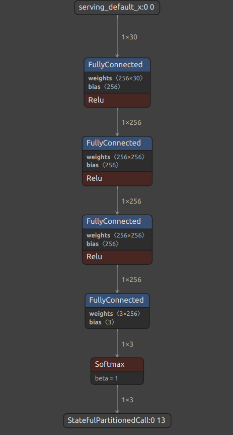

# Jammer Detection Documentation

## Input
This model has three input:

1. LTE RSSI: LTE RSSI (Received Signal Strength) is a measurement of the power present in a received radio signal. In our case, its the GPS signal.
2. Average Signal-to-Noise Ratio: This parameter measure thre ratio of desired signal power (in our case, its a GNSS signal) and backgroud noise power
3. Satellite Used / View: This parameter calculate the ratio between the number of satellite used to determine device location and satellite viewed by device

## Output
This model has three outputs:

1. Normal: Vehicle has normal GPS signal reception
2. Jammed: Vehicle is under jamming condition
3. Blankspot: Vehicle has no GPS signal reception

## Edge Impulse 
We build our model using [Edge Impulse](https://edgeimpulse.com/), a low code platform that enables developer to build machine learning model with minimalistic code approach. However, we can customise the code if we export it locally. You can refer to this [Readme](ei-jammer-detection-v2.1---paper-ready-nn-classifier/README.md)

Or, if we want to use edge impulse again, we can use exported project we provided [here](jammer-detection-v2.1-export/README.MD)

## Model Visualisation

This image shows model architecture. The machine learning model has three fully connected dense layer with ReLU activation function. At the output layer, we put softmax activation function. This output layer acts as aggregator of the model's output.

## Paper link

IEEE Link: [Jammer Detection on Embedded Android Implementation: Blue Bird Group Case Study](https://ieeexplore.ieee.org/document/10295731)